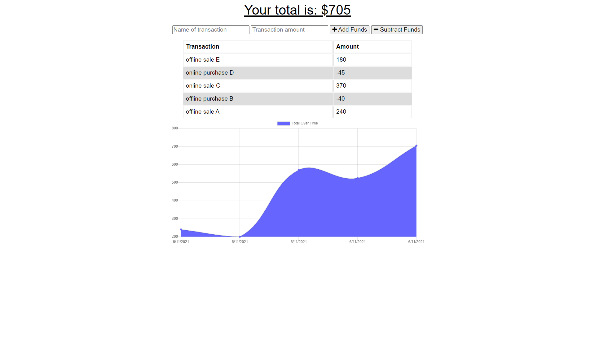

 

## **online/offline budget app** 
 

[https://damp-plains-35978.herokuapp.com/](https://damp-plains-35978.herokuapp.com/) 
 

## description

***
As an avid traveller I want to be able to track my withdrawals and deposits with or without a data/internet connection, so that my account balance is accurate when I am traveling. 
Online/Offline Budget App answers these needs and presents an easy to use UI to keep track of transactions, anytime, anywhere. This app utilizes Node.js, Express.js and IndexedDB for offline functionality. It was developed over front end starter code (Budget Tracker) and deployed to Heroku through MongoDB Atlas.  
 
 

## acceptance criteria

***

GIVEN a user is on Budget App without an internet connection: 

* WHEN the user inputs a withdrawal or deposit; THEN that will be shown on the page, and added to their transaction history when their connection is back online. 
 
 

## usage

***

Screenshots that shows the full generated web page: 
 

 

 

 
 
 

## some valuable references

***

These notes and links are listing some valuable references among others that I used doing this homework: 
 

[https://web.dev/offline-cookbook/#cache-falling-back-to-network](https://web.dev/offline-cookbook/#cache-falling-back-to-network)

[https://web.dev/offline-cookbook/#cache-falling-back-to-network](https://web.dev/offline-cookbook/#cache-falling-back-to-network)

[https://web.dev/offline-cookbook/#cache-falling-back-to-network](https://web.dev/offline-cookbook/#cache-falling-back-to-network)

[https://developer.mozilla.org/en-US/docs/Web/Manifest](https://developer.mozilla.org/en-US/docs/Web/Manifest)

[https://developer.mozilla.org/en-US/docs/Web/Progressive_web_apps](https://developer.mozilla.org/en-US/docs/Web/Progressive_web_apps)

[https://jscompress.com/]https://jscompress.com/)

[https://developer.mozilla.org/en-US/docs/Web/API/Intersection_Observer_API](https://developer.mozilla.org/en-US/docs/Web/API/Intersection_Observer_API)

[https://www.mongodb.com/cloud/atlas](https://www.mongodb.com/cloud/atlas)

[https://www.npmjs.com/package/compression]https://www.npmjs.com/package/compression)

[https://shields.io/category/dependencies/](https://shields.io/category/dependencies/)

[https://www.screencastify.com/](https://www.screencastify.com/)

 
 

## credits

***

Stephen Woosley - Bootcamp Instructor 
Patrick Haberern - Bootcamp TA 
Tim Nagorski - Bootcamp TA 
Sean Walmer - Bootcamp TA 
Alexis San Javier - Bootcamp Tutor 
 
 

## license

***

This is an assigment done under a bootcamp program, it is public but please contact the publisher before you use or
change any content. 
ghibli.github@gmail.com
 
 

## badges

***

 
 
